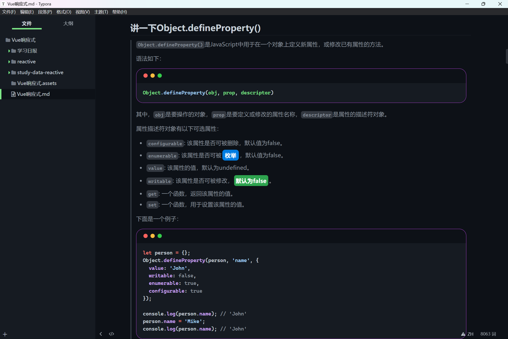
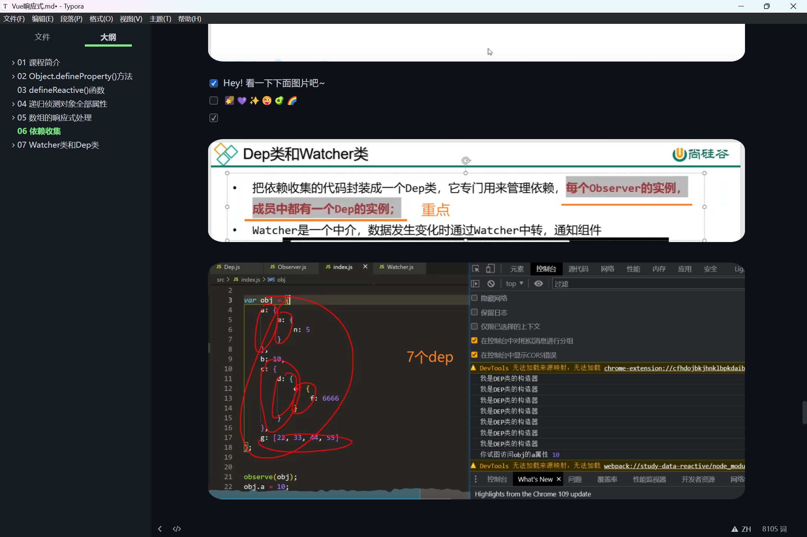

<h1 align="center">Ben Dark Themes for Typora</h1>

Typora themes based on GitHub Dark Default, Dark Dimmed, and Dark High-Contrast

​	

These themes were initially created by [Kinoute](https://github.com/kinoute/typora-github-night-theme), but have since been enhanced to provide a more authentic GitHub experience. For example, they now use the system fonts instead of Nunito, as GitHub does. In addition, several other improvements have been made, such as enhanced code block border-radius, colors, list spacing, text line height, font weight, and checkboxes, among others.

​	

## 需求分析

由于亮色主题在晚上阅读文档时并不太友好，网上暗黑主题风格并没有十分心仪的，so，我决定基于 [Typora-GitHub-Themes](https://github.com/Zabriskije/Typora-GitHub-Themes) 主题风格进行二创，结合 [typora-theme-redefine](https://github.com/EvanNotFound/typora-theme-redefine) 我有了以下想法：

- 代码块
  - Mac-红绿灯
  - 霓虹灯外观
  - 圆角
- 粗体/高亮
  - 按钮风格
  - 圆角
- 图片
  - 圆角
- 侧边栏
  - 以苹果绿为基调（黑+绿）
- 任务列表
  - 未选中：普通小方块
  - 已选中：蓝色复古小方块

​	

## Screenshots

​	

## Installation

1. Download the `ben-dark.css`
2. Launch Typora and go to `Settings...` → `Appereance` → `Open Theme Folder`
3. Copy the selected files to the `themes` folder and restart Typora
4. Click on `Themes` from the Menu Bar
5. Select the preferred theme
6. Enjoy!

​	

## Support

欢迎 **pull request** 或者 提交 **issues**.

如有问题，请发邮件到 [209441806@qq.com](mailto:209441806@qq.com). 我会及时回复

如果我做的主题还不错的话，欢迎给我 Github 点个 Star，谢谢！
