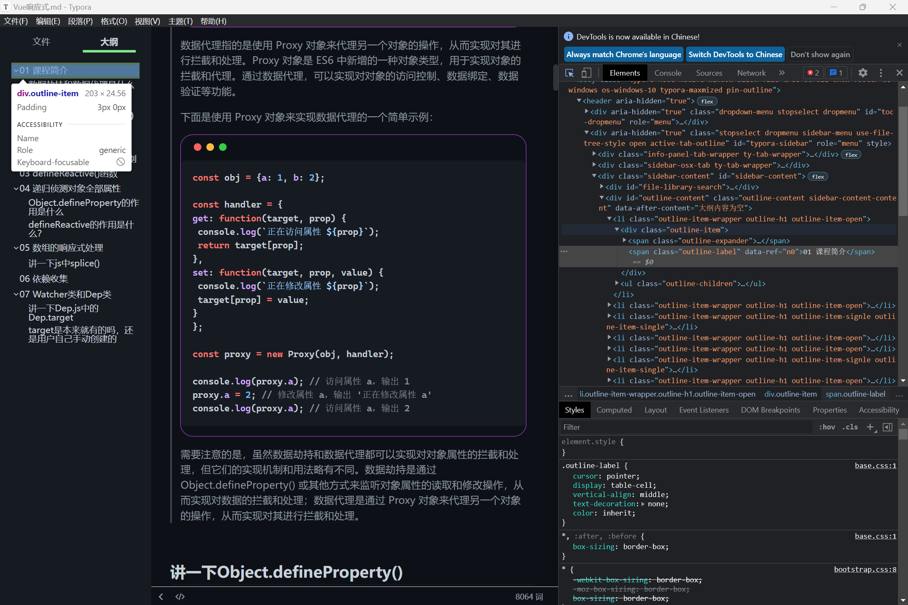

# 修改样式汇总

```css

/* 代码块-外区域 */
.md-fences{
  border-radius: 20px;
  border: 1px solid rgb(200, 72, 243);
  padding-top: 40px;
  position: relative;
  padding-right: 0px;
  padding-left: 0px;
}

/* 代码块-内区域 */
.CodeMirror{
  border-radius: 0px 0px 20.5px 20.5px;
}

/* Mac风格-红绿灯 */
.md-fences::after {
  content: " ";
  position: absolute;
  border-radius: 20px;
  background: #fc625d;
  width: 12px;
  height: 12px;
  top: 0;
  left: 20px;
  margin-top: 13px;
  -webkit-box-shadow: 20px 0px #fdbc40, 40px 0px #35cd4b;
  box-shadow: 20px 0px #fdbc40, 40px 0px #35cd4b;
  z-index: 3;
}

/* 更改加粗样式 */
strong{
  font-weight: bold;
  color: #fff;
  background-color: #2ea44f;
  border-radius: 6px;
  line-height: 2.2;
  padding: 5px;
  /* white-space: nowrap; 还是得换行，不然会把文字放在一行上 不是我想要的*/
  margin: 2.3px;
}

/* 优化高亮样式 */
mark {
	background-color: #0085f1ec;
	border-radius: 8px;
	color: white;
	line-height: 2;
	padding: 5px 7px;
	white-space: nowrap;
  font-weight: 600;
  margin: 2.3px;
}

/* 图片样式 */
.md-image>img {
	margin-top: 2px;
	padding-top: 10px;
	padding-bottom: 10px;
  border-radius: 30px;
}

/* 侧边栏-活跃文件左横线颜色 */
--active-file-border-color: #7ee787;

/* 侧边栏-文件下划线样式 */
.info-panel-tab-border {
	background-color: #7ee787 !important;
}

/* 侧边栏目录折叠/展开样式 */
.file-node-content .fa-caret-right,
.file-node-content .fa-caret-down {
	color: #7ee787;
}

/* 更改侧边栏-大纲 活跃文字样式 */
.outline-item-active{
  color: #7ee787;
}

/* Checkbox */
input[type="checkbox"]:before {
	content: "";
	display: inline-block;
	width: 1.1rem;
	height: 1.1rem;
	vertical-align: middle;
	text-align: center;
	border: 1px solid #999;
	border-radius: 3px;
	background-color: var(--item-hover-bg-color);
	margin-top: -0.5rem;
	margin-left: -0.1rem;
}

/* Checkbox hover */
input[type="checkbox"]:not([disabled]):not(:checked):hover:before {
	content: "\2713";
	font-size: 0.9rem;
	line-height: 1rem;
	color: var(--text-color);
}

/* Checkbox checked */
input[type="checkbox"]:checked:before {
	content: "\2713";
	font-size: 0.9rem;
	line-height: 1rem;
	color: var(--text-color);
	margin-top: -0.5rem;
	margin-left: -0.1rem;
  	background-color: rgb(0 0 0 / 20%);
}

/* bug：在有序列表中代码块底部显示溢出 */
/* Code block inside lists */
#write li .cm-s-inner {
	font-size: 1.05rem;
	font-weight: 500;
	margin-bottom: -0.65rem; /* 导致有序列表溢出的原因 */
} 
```


小结：

- 加粗并没有改变字体本身的颜色，只是改变了font-weight
- 菜单栏中 `视图`-`开发者工具` 可以打开控制台（omgggg！！！！！），更改你想要的样式
